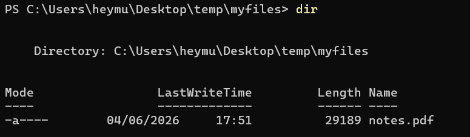
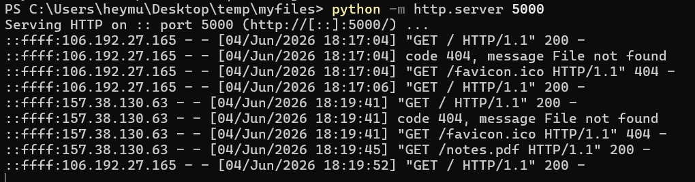
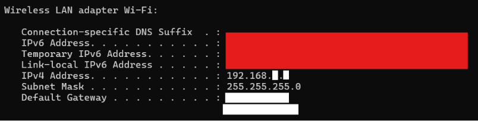
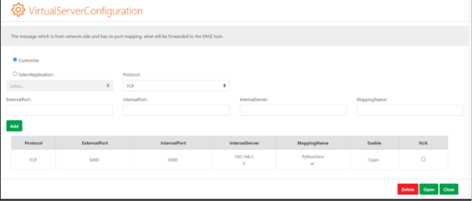

Before setting up any infrastructure, it is worth answering a simple question: **what exactly is a server?**

When people hear terms such as AWS, Azure, Google Cloud, or Vercel, they often imagine servers as something complex that exists somewhere inside "the cloud." In reality, a server is a much simpler concept. At its core, a server is simply a process running on a machine and listening on a network port for incoming requests.

The relationship is built around the **client-server model**. A client sends a request, and a server responds to it. Without a client, a server has nothing to serve.

This is also why a website is not AWS, Vercel, or Netlify. Those platforms provide infrastructure and automation, but the website itself is ultimately a running process accessible over a network through a specific TCP port.

For the first session of my HomeLab series, I wanted to explore this concept using only the hardware I already own. Instead of renting a VPS or purchasing a Raspberry Pi, I used my laptop as the server and my phone as the client.

---

## The Local Network

Both devices were connected to the same home Wi-Fi network, which means they were part of the same **Local Area Network (LAN)**.

Inside a LAN, devices can communicate directly with one another using their private IP addresses. If one device hosts a service on a particular port, other devices on the network can access that service by connecting to the device's IP address and port combination.

For this experiment, I used Python's built-in HTTP server to expose a directory on my laptop over the network.

---

## Step 1: Create the Directory to Host

Choose the directory you want to expose through the HTTP server.



---

## Step 2: Connect Both Devices to the Same LAN

Ensure that both the server (laptop) and client (phone) are connected to the same Wi-Fi network.

---

## Step 3: Start the Python HTTP Server

From inside the target directory, start a simple HTTP server:

```bash
python -m http.server 5000
```

I chose port **5000** because other commonly used ports on my system were already occupied. The specific port number is not important as long as the process can successfully bind to it.



---

## Step 4: Find the Local IPv4 Address

On Windows, the local IP address can be identified using:

```powershell
ipconfig
```

Locate the IPv4 address associated with your active network adapter.



---

## Step 5: Access the Server from the Client Device

Open a browser on the client device and navigate to:

```text
http://<ipv4-address>:5000
```

At this point, the files hosted on the laptop become accessible from any device connected to the same LAN.

---

# Moving Beyond the LAN

Serving content inside a local network is straightforward. The more interesting question is how to make that service accessible from outside the network.

Home routers use **Network Address Translation (NAT)**, which means devices inside the LAN are hidden behind a single public IP address. By default, incoming internet traffic has no way of knowing which internal device should receive a connection request.

To expose the server publicly, a **port forwarding** rule must be configured on the router.

---

## Configuring Port Forwarding

First, log in to the router's administration interface. For many home routers, this is accessible through an address such as:

```text
http://192.168.1.1
```

The exact address varies by manufacturer.

Once logged in, navigate to the NAT or Port Forwarding configuration page and create a rule that forwards incoming traffic on port **5000** to the laptop's private IP address.



With the forwarding rule in place, requests arriving at the router's public IP address can be routed directly to the Python HTTP server running on the laptop.

---

# Takeaways

This small experiment reinforced an important idea: infrastructure is not magic.

The same fundamental concepts that power large-scale hosting platforms can be observed on a laptop sitting on a desk. A server is a process. A website is a process. Access to that process is controlled through networking, ports, and routing.

While platforms such as cloud providers offer scalability, reliability, and operational convenience, understanding the underlying mechanics provides a much clearer picture of how modern internet services actually work.

For me, this lab was less about hosting files and more about understanding the fundamentals behind every web application, API, and cloud deployment I interact with as a cybersecurity student.
