The target is given as an ip address. Naturally, it doesn't resolve on the first go, so I have to edit /etc/hosts using `echo "ip-addr orion.htb" | sudo tee -a /etc/hosts.` The primary purpose of /etc/hosts is to map hostnames to ip addresses locally. Operating systems are traditionally configured to check this file before querying external DNS servers.

By the looks of it, orion-dot-htb looks like an important website that manages connectivity for governments and global enterprises.

We notice that there is a form, which naturally makes me think if there is anything that I can do with sqlmap with this. This is the **first vector** that came to my mind upon seeing a form. Professionally, website developers these days are becoming more and more aware about sql injections, which could mean that wasting time over this might not be a good thing. But the most important thing for pentester is to test. We can enter normal inputs and see that it returns errors over frontend. Not a very interesting find personally. 

**As a homework, my task is to delve deeper into sqlmap by this weekend.**

Let's move forward.

We notice that the website developer left the CMS (Content Management System) tool by the name of `CraftCMS`. The vector that goes in this case is to find the specific `version` of the CMS and then search for a specific CVE, and carry out the exploit using **Metasploit**.
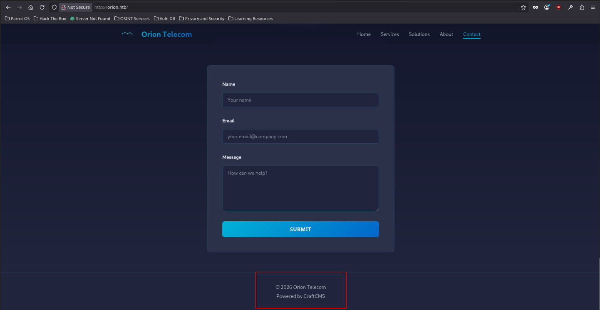
In the case of web-enum exercises, we generally check for **exposed paths.** The first place to look for exposed paths is `robots.txt`. Funnily, there is some interesting soup that is found as shown below.
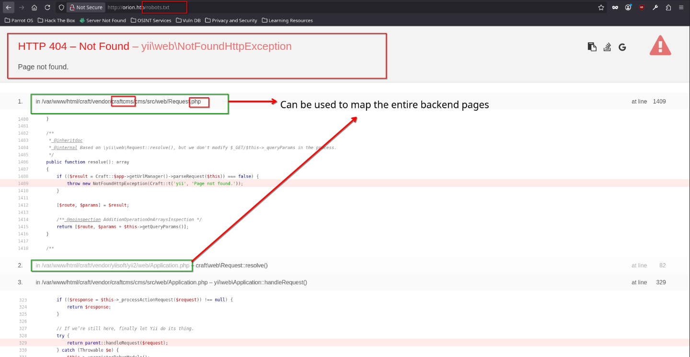
Without wasting more time, I run gobuster over the website which is a directory enum tool. 

Tool : Gobuster
Command: `gobuster dir -u http://orion.htb -w <wordlist>`

For wordlists I use the common.txt under seclists -> Web Content 
We notice interesting findings of exposed pages:
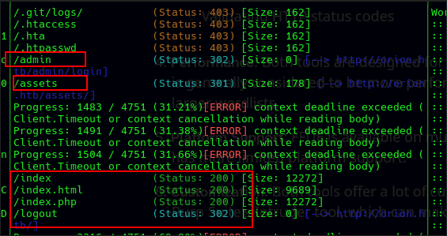
Proceeding over to the login page, we find that the `CraftCMS` version is neatly leaked. This implies our vector that we thought of earlier is now loaded and ready to be fired. Before moving on, as a pentester, it is important to check other exposed pages to better highlight the nuisance the website developer has left behind.
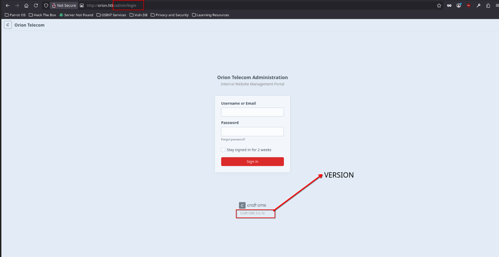

Under the `/assets` route, we notice that the banner is leaked. This is specifically called as **passive web banner exposure**. Even tho we did not run tools like `nmap` (network mapper) with complex settings, the web server grabbed its own banner and handed it to us on a silver platter inside the **error page**. This is known as a **server signature**.

It highlights a couple of things:
1. The target operating system
2. OS Fingerprinting: Fingerprinting is the process of gathering technical details from a target device to uniquely identify what it is. OS fingerprinting can be done in both **active** as well as **passive** methods. In the case of active method, we use `nmap -O` to grab the OS details. This method maybe noisy and might trigger IDS/IPS systems or simply be blocked by firewalls, if you are not careful with what type of scan `(-sS, -sT, DNS proxying, decoy, etc)` along with other parameters like` --min-rtt, T1..5 `you use for **nmap optimizations.**  Passive OS fingerprinting can be done using nmap also, if we notice the **TTL (Time to live)** of packets is different for different OSes and additionally we can check that using **tcpdump/wireshark**. 
3. However, it is important to note that banners can be **easily faked by an admin.**

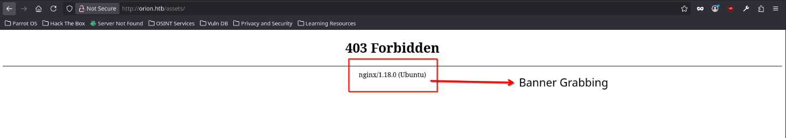

CraftCMS version exploit on ExploitDB highlights the cve version.
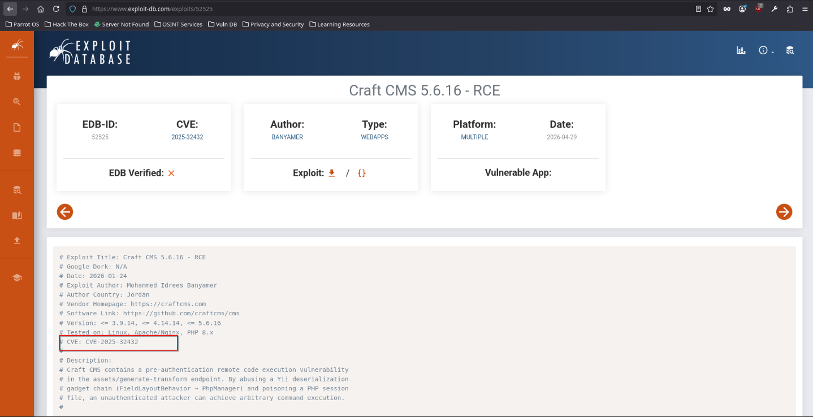
We can then go on to search the same exploit using metasploit using `search cve-2025-xxxxx` command, followed by `show options`, setting up `lhost, rhosts`. 

We quickly get into the system
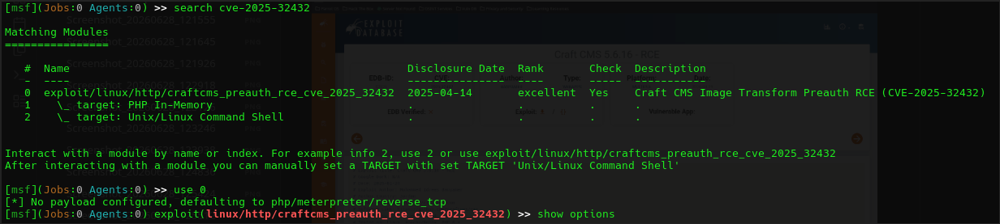

We obtain the foothold into the system

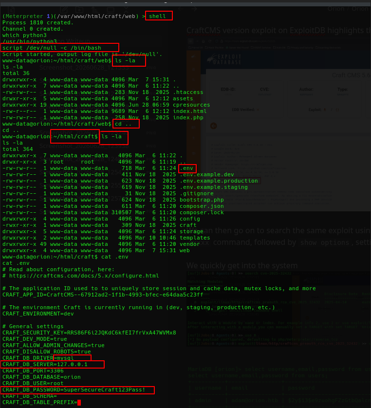

We can now connect to the open mysql instance
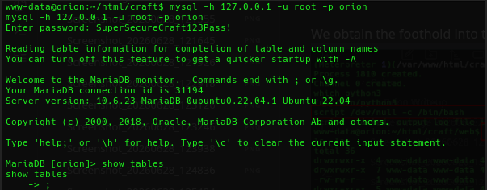

We dive deeper into the database
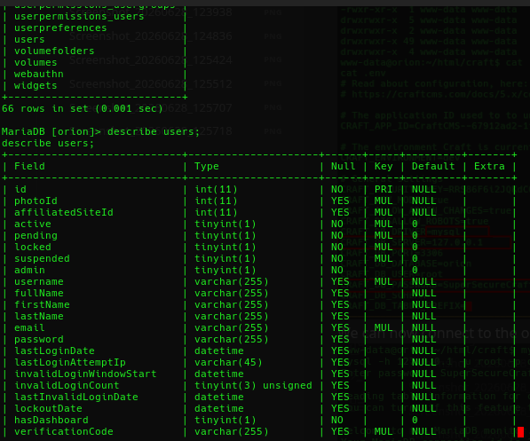

Finally we obtain juicy information
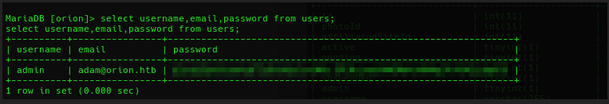
We notice that the password is hashed using **bcrypt** by noticing its format. Please refer to [Hash Identification Reference Guide]([https://github.com/heymuun/notes](https://dev.to/ff02x9e/hash-identification-reference-guide-3kl7)) for interesting details regarding hash identification and related tooling that can be used.

We can then crack this hash using hashcat (with -m 3200)
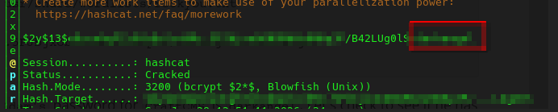

This reveals that the password is:

Click to reveal spoiler

darkangel

Now we can use the same creds to ssh into the server.
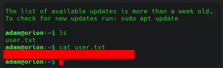
Hence, obtaining the user flag.

In order to privesc, please refer to the official HTB writeup.
It is interesting to note that I tried privesc by running **linpeas** on the target machine and discovering that its sudo version could be vuln to sudoedit based on its version 1.9.9. However, that exploit (found on exploitDB) didn't work which meant that there was no problem with sudoedit. The HTB writeup uses netstat -tulnp and discovering telnet as open port (port 23) then finding out its version using `telnet --version` and discovering a 2026 CVE exploit as found over [link](https://nvd.nist.gov/vuln/detail/CVE-2026-24061)

